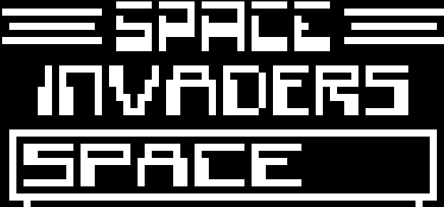

# chip-8-emulator
Chip-8 is a virtual machine that is able to run Chip-8 programs.

This is an implementation of a Chip-8 emulator in C++ using SDL2.

# Tetris

# Tank

# Space Invaders

# Start:
You can start this by `./chip-8-emulator.exe 10 3 <ROM_File>`.

# Special thanks to:
* Austin Morlan's tutorial.
